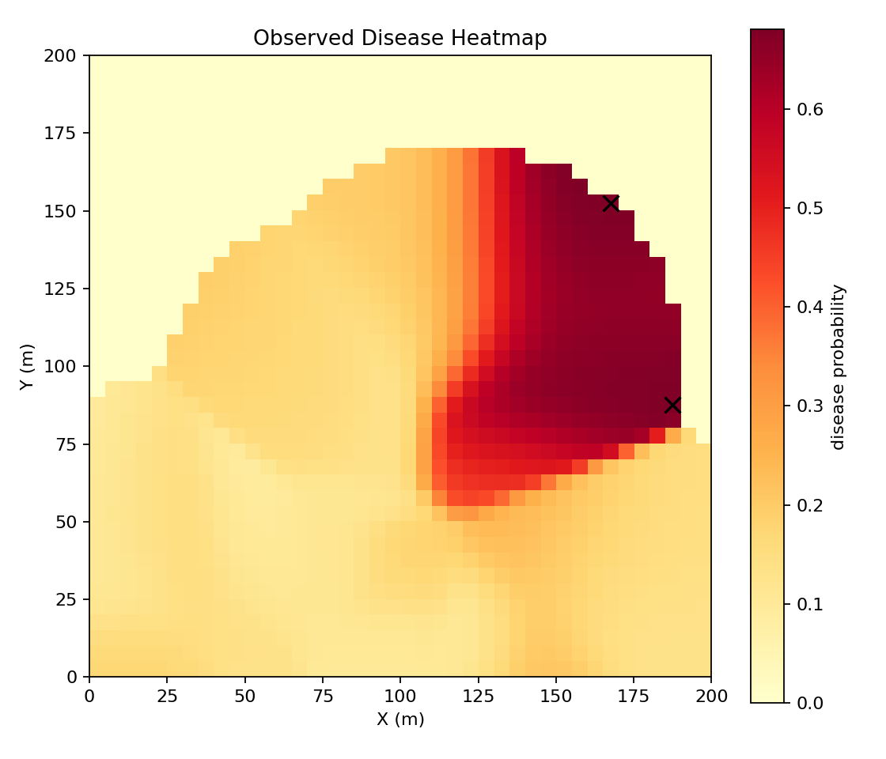
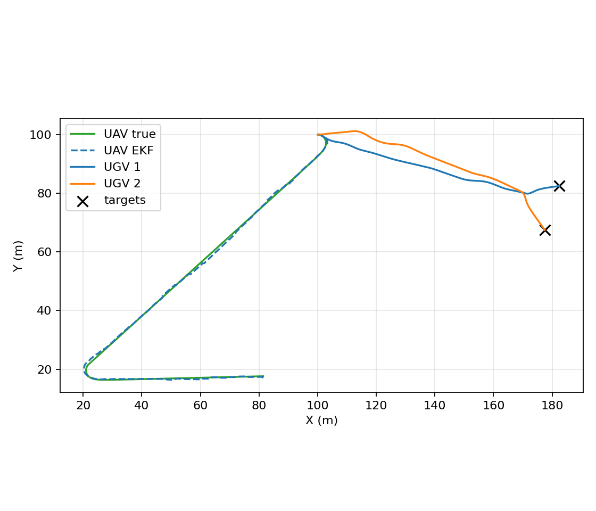
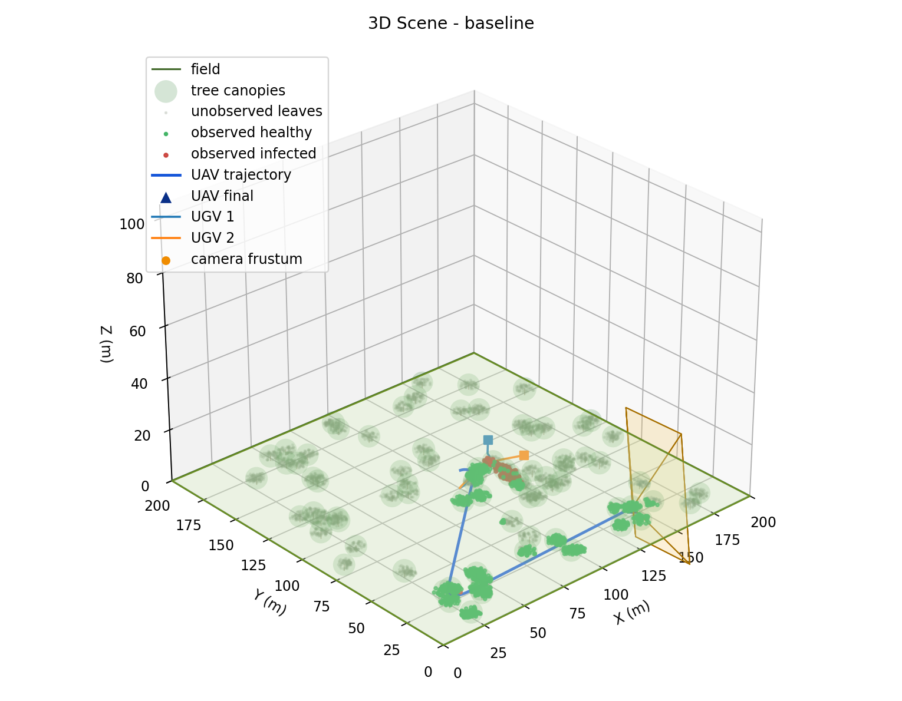

# Green Vigilance


Green Vigilance is a Python-first UAV/UGV simulation prototype for early crop disease detection in precision agriculture. The project began as a MATLAB prototype; the active runtime is now the Python package under `src/green_vigilance/` and does not require MATLAB.

The archived MATLAB material is kept in `matlab_legacy/` for reference only. The Python implementation is a runnable migration foundation, not a scientifically complete or production-ready reproduction of the original report.

## Features

- Scenario-driven UAV/UGV precision-agriculture simulation.
- UAV unicycle motion with EKF-based state estimation.
- Camera field-of-view, depth/range, and frustum-based leaf observation model.
- First-pass disease propagation and observed disease heatmap generation.
- First-pass UGV target assignment and obstacle-aware waypoint motion.
- Generic WLS estimator module for future cooperative UGV localization work.
- Static 2D and 3D Matplotlib outputs for each scenario.
- JSON scenario summaries and CSV/Markdown scenario comparison outputs.
- Pytest coverage and GitHub Actions CI.

## Project Status

| Component | Status | Notes |
|---|---|---|
| Python package | Implemented | Installable from `src/green_vigilance/` |
| MATLAB dependency | Removed from active path | MATLAB files are archived as legacy/reference material |
| Scenario configs | Implemented | Baseline, high-noise, and extreme-uncertainty YAML scenarios with structured validation |
| Unicycle dynamics | Implemented | Ported from MATLAB prototype |
| UAV EKF | Implemented | GPS update and gyro-driven prediction |
| Camera FoV / DoF / frustum | Implemented | Ported and simplified for Python |
| Procedural plant field | First-pass implementation | Conceptual migration, not biologically validated |
| Disease propagation | First-pass implementation | Simplified stochastic tree-level spread |
| Heatmap generation | First-pass implementation | Based on observed leaf health |
| UGV movement | First-pass implementation | Waypoint tracking with simple obstacle avoidance |
| WLS | Implemented, lightly integrated | Generic weighted position estimator; not yet deeply integrated into full UGV localization |
| 3D visualization | Basic implementation | Matplotlib scene overview written per scenario |
| MATLAB/Python equivalence | Not validated | Numerical equivalence tests are future work |

## Installation

Create a virtual environment and install the package in editable mode:

```bash
python3 -m venv .venv
source .venv/bin/activate
python -m pip install --upgrade pip
pip install -e ".[dev]"
```

`requirements.txt` is also provided for simple dependency installation:

```bash
python3 -m pip install -r requirements.txt
```

## Run Simulations

After installation, run a scenario with either the module entry point or console script:

```bash
python -m green_vigilance --config configs/baseline.yaml
green-vigilance --config configs/baseline.yaml
```

Additional scenarios:

```bash
python -m green_vigilance --config configs/high_noise.yaml
python -m green_vigilance --config configs/extreme_uncertainty.yaml
```

Expected generated outputs:

- `results/<scenario>/figures/heatmap.png`
- `results/<scenario>/figures/trajectories.png`
- `results/<scenario>/figures/scene3d.png`
- `results/<scenario>/summary.json`

For example, the baseline scenario writes:

- `results/baseline/figures/heatmap.png`
- `results/baseline/figures/trajectories.png`
- `results/baseline/figures/scene3d.png`
- `results/baseline/summary.json`

Scenario YAML files are validated before the simulation starts. Missing required sections and invalid ranges fail early with readable field-path messages. The 3D scene is a PNG; open it with any image viewer or from the generated results directory.

`results/` is generated output and is ignored by git.

## Compare Scenarios

After running the baseline, high-noise, and extreme-uncertainty scenarios, generate a compact comparison report:

```bash
python -m green_vigilance.compare --results results
```

This writes:

- `results/scenario_comparison.csv`
- `results/scenario_comparison.md`

## Example Outputs

The simulation writes generated outputs under `results/<scenario>/figures/`.
The full `results/` directory is ignored by git. A small curated baseline example is kept under `docs/assets/` for GitHub presentation.

The 3D visualization is a static Matplotlib debugging overview inspired by the MATLAB visualization. It is not fully equivalent to the MATLAB graphics, and scientific equivalence with MATLAB has not yet been validated.

### Baseline heatmap



### Baseline UAV trajectory



### Baseline 3D scene



## Tests

```bash
python -m compileall src
pytest -q
```

CI runs compile checks, tests, and the baseline scenario on GitHub Actions.

## Repository Structure

```text
configs/                 Scenario YAML files
docs/                    Reports, migration notes, and cleanup notes
matlab_legacy/           Archived MATLAB prototype/reference code
src/green_vigilance/     Active Python package
tests/                   Pytest tests
```

## Known Limitations

- Disease propagation is a simplified stochastic approximation, not a validated biological model.
- UGV obstacle avoidance is simple local steering, not a full planner.
- WLS is available as an estimator but is not yet deeply integrated into full UGV localization.
- The Python 3D visualization is a static Matplotlib overview, not a full reproduction of MATLAB graphics or an interactive scene.
- MATLAB/Python numerical equivalence has not been validated.

## Roadmap

- Validate Python outputs against selected MATLAB reference cases and report equations.
- Integrate WLS into UGV cooperative localization instead of keeping it as a standalone estimator.
- Replace the first-pass disease model with a documented agronomic model.
- Improve visualization with richer 3D inspection and optional animation.
- Package a reproducible release with pinned example outputs and documented scenario baselines.

## Relation to the Original Report

The original project report is preserved in `docs/Report_distribution_project.pdf`. The Python implementation preserves the core direction of the original UAV/UGV disease-monitoring workflow, but future work is needed to validate numerical equivalence and scientific assumptions.

See `docs/migration_report.md` and `docs/cleanup_report.md` for migration and cleanup details.

## License

This project is licensed under the terms in `LICENSE`.
